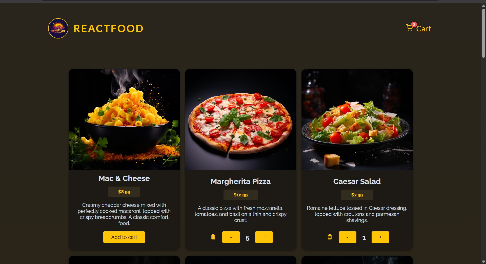
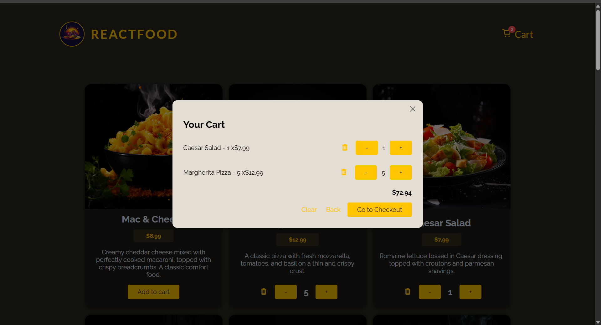
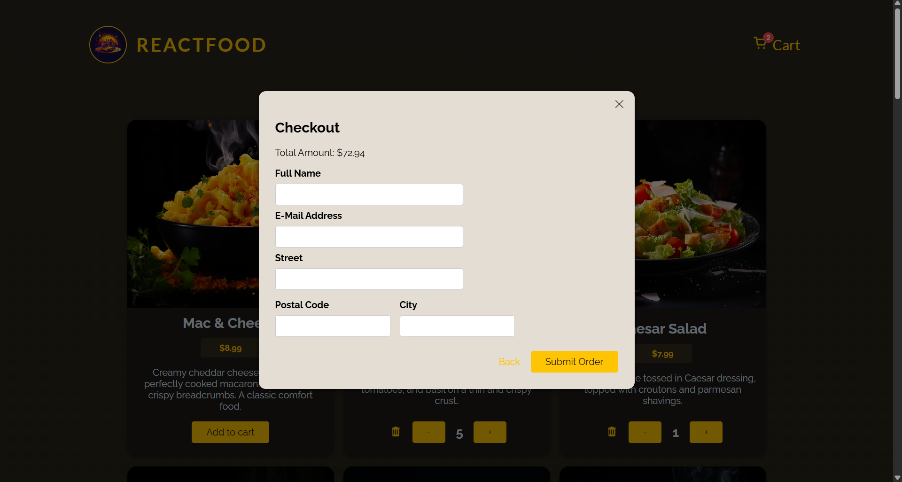
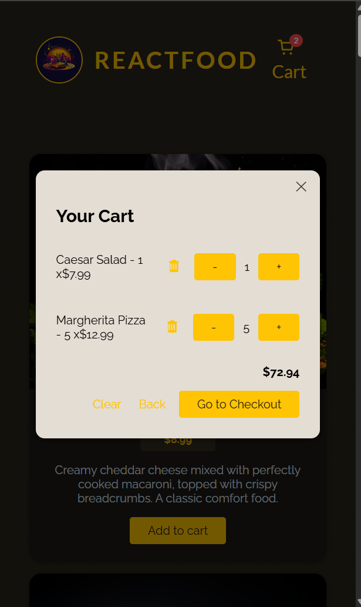

# 🍔 Food Ordering App

> A modern and responsive food ordering web application built with **React** and **Vite**.
> The app allows users to browse products, manage a shopping cart, and experience a clean and smooth UI.

---

## 🚀 Live Demo

👉 _Coming Soon_ (Add your Vercel / Netlify link here)

---

## 📸 Screenshots

### Home Page



### Cart



### Checkout



### Mobile-View



---

## ✨ Features

✔ Browse food products
✔ Add items to cart
✔ Update item quantity
✔ Cart total calculation
✔ Fully responsive design
✔ Clean and reusable components
✔ Smooth user experience

---

## 🛠️ Tech Stack

- **React.js**
- **Vite**
- **JavaScript (ES6+)**
- **CSS**
- **Redux (Toolkit)**
- Rest APIs

---

## 📁 Project Structure

```bash
food-ordering-app/
├── frontend/
│   ├── src/
│   ├── public/
│   └── ...
├── backend/
└── README.md
```

---

## ⚙️ Installation & Setup

### 1️⃣ Clone the repository

```bash
git clone https://github.com/ahmedanwar-pro/food-ordering-app.git
```

### 2️⃣ Navigate to frontend

```bash
cd frontend
```

### 3️⃣ Install dependencies

```bash
npm install
```

### 4️⃣ Run the project

```bash
npm run dev
```

---

## 📌 Future Improvements

- 🔐 Authentication system
- 🌐 Backend integration (API)
- 💳 Payment system
- 📦 Order history

---

## 🤝 Contributing

This project is built for learning and portfolio purposes. Contributions are welcome.

---

## 📄 License

This project is open-source and available under the MIT License.

---

## 👨‍💻 Author

**Ahmed Anwar**
Front-End Developer
